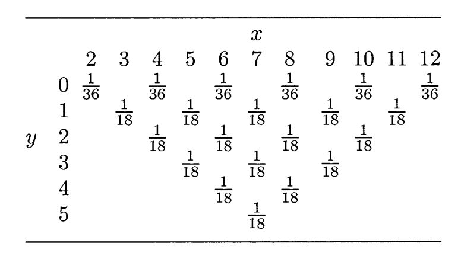

---
---

## Joint PMF

Sia $(X,Y)$ una *v.a. **discreta bivariata***.
La funzione $f\_{X,Y}: \mathbb{R}^2 \to \mathbb{R}$ definita come
$$f\_{X,Y}(x,y) = P(X = x \cap Y = y)$$
è detta **joint probability mass function** (**funzione di probabilità congiunta**).

Osservare che per v.a. discrete avremo
$$P((X,Y) \in A) = \sum\_{(x,y) \in A}f\_{X,Y}(x,y)$$

Per esempio per $X,Y \sim U{1,2,3}$ avremo
$$P(X = 3, Y \leq 2) = P((X,Y) \in {(1,3), (2,3), (3,3)}) = f\_{X,Y}(1,3) + f\_{X,Y}(2,3) + f\_{X,Y}(3,3) = \frac{1}{3}$$

### Proprietà

Sia $g$ una funzione definita su tutti i possibili valori di $(X,Y)$.
Allora avremo che $g(X,Y)$ sarà anch'essa una v.a. multivariata, con media
$$\mathbb{E}\left\[ g(X,Y) \right\] = \sum\_{(x,y) \in \text{SUP}(X,Y)}g(x,y)f\_{X,Y}(x,y)$$

### Esempio

Consideriamo la seguente tabella

Calcolare la media della v.a. $g(X,Y) = XY$.

$$\mathbb{E}\left\[ XY \right\] = 0 \cdot \frac{1}{36} \cdot \left\[ 2 + 4 + 6 + 8 + 10 + 12 \right\] + 1 \cdot \frac{1}{18} \cdot \left\[ 3 + 5 + 7 + 9 + 11 \right\] + 2 \cdot \frac{1}{18} \cdot \left\[ 4 + 6 + 8 + 10 \right\] + 3 \cdot \frac{1}{18} \cdot \left\[ 5 + 7 + 9 \right\] + 4 \cdot \frac{1}{18} \cdot \left\[ 6 + 8 \right\] + 5 \cdot 7 \cdot \frac{1}{18} = 13 \cdot \frac{11}{18}$$

## Teorema 4.1.6 - Distribuzioni marginali

Sia $(X,Y)$ una v.a. bivariata discreta con *joint pmf* $f\_{X,Y}(x,y)$.
Allora le **marginal pmf** (**distribuzioni marginali**) $f_X(x) = P(X = x)$ e $f_Y(y) = P(Y = y)$ sono definite come
$$f_X(x) = \sum\_{y \in \mathbb{R}} f\_{X,Y}(x,y)$$
$$f_Y(y) = \sum\_{x \in \mathbb{R}} f\_{X,Y}(x,y)$$

## Joint PDF

Sia $(X,Y)$ una *v.a. **continua bivariata***.
La funzione $f\_{X,Y}: \mathbb{R}^2 \to \mathbb{R}$ è detta **joint probability density function** (**funzione di densità congiunta**) per il vettore aleatorio $(X,Y)$ se per ogni $A \subseteq \mathbb{R}^2$ è vero che
$$P((X,Y) \in A) = \iint_A f\_{X,Y}(x,y) , dx , dy$$

### Proprietà

Analogamente a prima, sia $g$ una funzione definita su tutti i possibili valori di $\mathbb{R}^2$.
Allora avremo che $g(X,Y)$ sarà anch'essa una v.a. multivariata continua, con media
$$\mathbb{E}\left\[ g(X,Y) \right\] = \iint\_{\mathbb{R}^2}g(x,y)f\_{X,Y}(x,y)$$

## Estensione continua di teorema 4.1.6

Sia $(X,Y)$ una v.a. bivariata continua con *joint pdf* $f\_{X,Y}(x,y)$.
Allora le **marginal pdf** (**densità marginali**) $f_X(x)$ e $f_Y(y)$ sono definite come
$$f_X(x) = \int\_{-\infty}^{\infty} f\_{X,Y}(x,y) , dy$$
$$f_Y(y) = \int\_{-\infty}^{\infty} f\_{X,Y}(x,y) , dx$$

### Esercizio I

Sia la **joint pdf** definita come segue
$$
f\_{X,Y}(x,y) = \begin{cases}
6xy^2 &\text{per } x, y \in (0,1)\\
0 &\text{altrimenti}
\\end{cases}
$$
La funzione di porbabilità sarà quindi
$$
\\int\_{-\infty}^{\infty}\int\_{-\infty}^{\infty}f(x,y) ,dx,dy =
\\int\_{0}^{1}\int\_{0}^{1}6xy^2 ,dx,dy =
\\int\_{0}^{1}3x^2y^2 \Big\vert_0^1,dy =
\\int\_{0}^{1}3y^2,dy = y^3 \Big\vert_0^1 = 1
$$

Supponiamo ora di voler calcolare la probabilità $P(X+Y \geq 1)$.
Sia l'insieme $A := {(x,y): x+y \geq 1}$.
Possiamo quindi esprimere la nostra probabilità come $P((X,Y) \in A)$.

Per caclore ora la nostra probabilità dobbiamo integrare sul piano $A$.
Però dato che la *densità* al di fuori del quadrato unitario $(0,1) \times (0,1)$ è nulla, allora integrare su $A$ equivale ad integrare nell'intersezione tra $A$ è il quarato unitario.
Perciò
$$\begin{align\*}
A'
&= A \cap \left\[(0,1) \times (0,1) \right\]\\
&= { (x,y) : x+y \geq 1, 0 \< x \< 1, 0 \< y \< 1 }\\
&= { (x,y) : y \geq 1 - x, 0 \< x \< 1, 0 \< y \< 1 }\\
&= { (x,y) : 1 - x \leq y \< 1, 0 \< x \< 1}\\
\\end{align\*}$$

Perciò avremo che
$$P(X+Y \geq 1) = P((X,Y) \in A') = \int\_{0}^{1}\int\_{1-x}^{1} 6xy^2 ,dy,dx = \frac{9}{10}$$

### Esercizio II

Siano $X,Y \in \mathbb{R}^+$ v.a. i.i.d. **esponenziali** di parametro 1, ovvero $f(x) = e^{-x}$ e $f(y) = e^{-y}$.
Grazie all'indipendenza avremo che la loro densità congiunta sarà
$$f(x,y) = P(X=x, Y=y) = P(X = x)P(Y=y) = f(x)f(y) = e^{-x}e^{-y} = e^{-(x+y)}$$

Sia la v.a. $S=X+Y$ con funzione di ripartizione
$$F_S(t) = P(S \leq t) = P(X+Y \leq t)$$
Avremo quindi
$$F_S(t) = \int\_{0}^{t}\int\_{0}^{t-x} f(x,y) ,dy,dx = \int_0^t -e^{-(x+y)} \Big\vert_0^{t-x} ,dx = \int_0^t e^{-x} - e^{-t} ,dx = -e^{-x} -xe^{-t} \Big\vert_0^t = -e^{-t} - te^{-t} + 1$$

Da $F_S(t)$ siamo in grado di calcolare la densità di $S$
$$f_S(t) = D(F_S(t)) = te^{-t} \sim \Gamma(2,1)$$

---

## Indipendenza

Sia $(X,Y)$ un v.a. **bivariata** con *densità congiunta* $f(x,y)$.
Allora $X$ e $Y$ sono **indipendenti** se e solo se esistono due funzioni $g(x)$ e $f(y)$ tali che
$$f(x,y) = g(x) h(y) ;; \forall x,y \in \mathbb{R}$$

### Proof

Certamente c'è indipendenza allora avremo che $g(x) = f_X(x)$ e $h(y) = f_Y(y)$.

Viceversa, supponiamo che $f(x,y) = g(x)h(y)$.
Definiamo $$\int\_{\mathbb{R}} g(x) ,dx = c$$ e $$\int\_{\mathbb{R}} h(y) ,dy = d$$ tali che $c,d$ soddisfano
$$\begin{align\*}
cd
&= \left( \int\_{\mathbb{R}} g(x) ,dx \right) \left( \int\_{\mathbb{R}} h(y) ,dy \right)\\
&= \iint\_{\mathbb{R}^2} g(x)h(y) ,dx,dy\\
&= \iint\_{\mathbb{R}^2} f(x,y) ,dx,dy\\
&= 1
\\end{align\*}$$
Ovvero il loro prodotto deve essere una distribuzione.

Calcoliamo le densità marginali
$$f_X(x) = \int\_{\mathbb{R}} g(x)h(y) , dy = g(x)d$$
$$f_Y(y) = \int\_{\mathbb{R}} g(x)h(y) , dx = h(y)c$$

Unendo i due punti precedenti avremo che
$$f(x,y) = g(x)h(y) = (h(y)c) \cdot (g(x)d) = f_X(x)f_Y(y) ;;\square$$

### Esempio

Sia $f(x,y) = \frac{1}{8} x^2 y^4 e^{-y-(x/2)}$ per $x >0$ e $y>0$, altrimenti $f(x,y) = 0$.
Sicuramente $X$ e $Y$ sono indipedenti, infatti $f(x,y) = g(x)h(y)$ con
$$
g(x) = \begin{cases}
x^2e^{-x/2} &x > 0\\
0 &x \leq 0
\\end{cases}
$$
e
$$
h(y) = \begin{cases}
\\frac{1}{8}y^4e^{-y} &x > 0\\
0 &x \leq 0
\\end{cases}
$$

---

## Moment Generating Function

Sia $X$ una v.a.
La sua **funzione generatrice dei momenti** (**mgf**) è definita come
$$M_X(t) = \mathbb{E} \left\[ e^{tX} \right\]$$

## Teorema - somma mgf

Siano $X$ e $Y$ v.a. **indipendenti** con mgf $M_X(t)$ e $M_Y(t)$.
Allora la v.a. $Z=X+Y$ avrà mgf
$$M_Z(t) = \mathbb{E} \left\[ e^{t(X+Y)} \right\] = \mathbb{E} \left\[ e^{tX} e^{tY} \right\] = \mathbb{E} \left\[ e^{tX} \right\]\\mathbb{E} \left\[ e^{tY} \right\] = M_X(t)M_Y(t)$$

## MGF of Normal variable

Sia $X \sim N(\mu, \sigma^2)$.
Essa avrà mgf
$$M_X(t) = e^{\mu t + \frac{1}{2}\sigma^2t^2}$$

## MGF of sum of normal variables

Siano $X \sim N(\mu_1, \sigma_1^2)$  e $Y \sim N(\mu_2, \sigma_2^2)$.
La mgf della v.a. $Z = X+Y$ sarà
$$M_Z(t) = M_X(t)M_Y(t) = \exp((\mu_1+\mu_2)t + (\sigma_1^2 + \sigma_2^2)t^2/2)$$
Ovvero $Z \sim N(\mu_1+\mu_2, \sigma_1^2+\sigma_2^2)$.

---
